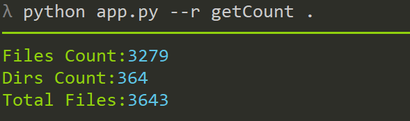

# TUtils


TUtils mean T's Utils


## Use

### get List

```cmd
python app.py -l
```

### run

such as `getCount` in category `file` 

use

```cmd
python app.py -r file.getCount .
```

if only one `getCount` file in all category,can use

```cmd
python app.py -r getCount .
```




### View Code

```cmd
python app.py --code file.getCount
```


## list

|        name        |             descript             |      param       |           example            |
| :----------------: | :------------------------------: | :--------------: | :--------------------------: |
|   file.getCount    |  get file and dir count in dir   | path,[show_name] |       file.getCount .        |
| file.removeByExten | remove files by extension in dir |  path,extension  | file.removeByExten ./ txt py |

you can find more in [Doc | List](./doc/list.md)


## License

MIT,Thanks!