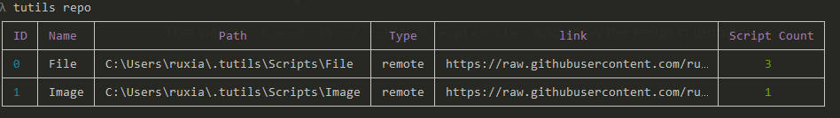
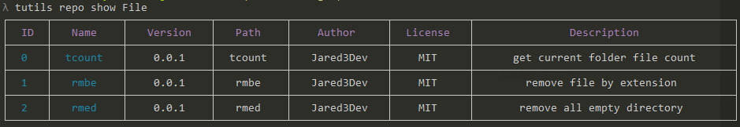

# Quick Start

after installing TUtils, you can quickly get started by running the following command in your terminal:

```bash
tutils --help
```

## show repository list

```bash
tutils repo
```



## get script list in repository

```bash
tutils repo show file
```


## run a script

This will run `tcount` in `~/.tutils/Scripts/File`, and show the result in terminal.

you should add `:` before it if you want use arguments to run script.

```bash
tutils run tcount :-s
```
